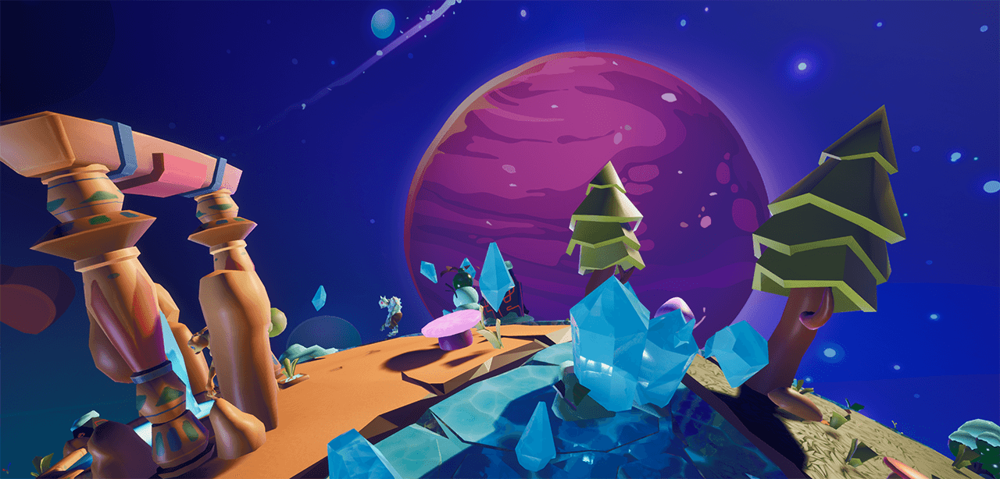
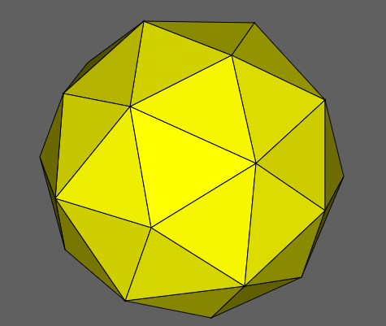

# APieceOfPlanet

*Please note that these files are just a few of the files in the entire project: they will not compile! This is meant to show the things I have worked on during this project.*



The project "A Piece of Planet" was made by five people, including me. It is a game made in Unreal Engine 4 during the course "Group projects", at Digital Arts and Entertainment, Howest, Belgium.
In this repository, I only put the files that I worked on, to give a more condensed overview of what I did during  the 12 weeks this project ran.

# Environment

The game features a spherical, tiled planet, which gave some challenges. The first thing I tackled was the gravity, which wasn't a simple "pointing down" anymore. Gravity had to point to an arbitrary point that we could choose.
While gravity in itself was a fairly quick fix, the fact that the planet was also tiled gave a whole other set of issues.
* Dividing a sphere so it is made out of x amount of shapes, while keeping those shapes the exact same.
* The tiles should be generated in place.
* Gravity should not cause the player to fall between gaps, or make weird bounces over egdes.

## Tiling a sphere
This part mainly required research. It took a while, but in the end I found a shape that fit all of our requirements. It isn't a perfect sphere, but comes close enough to pass as one, and the tiles are all the same shape and size, just rotated a bit differently.


The next part was actually getting one mesh for a tile, and then generating a bunch of copies into place at runtime. Our goal was to have the tiles be different biomes after all, and these biomes needed to be chosen randomly. Luckily, once the right geometry was found, the actual code for this generation wasn't too hard anymore. I used an indexbuffer and a vertexbuffer to define the positions of the vertices of the pentakis dodecahdron, and then went on to calulcate how the tile itself should be located and rotated per polygon.
```cpp
void ATileManager::BeginPlay()
{
	Super::BeginPlay();
	
	//GENERATION
	for (int triangle{ 0 }; triangle < m_IndexBuffer.size(); ++triangle)
	{
		FVector middlePoint{ CalculateTriangleMiddlePoint(triangle) };
		FRotator rotation{ CalculateTriangleRotation(triangle, middlePoint) };
		FTransform transform{ rotation, middlePoint, {Scale, Scale, Scale} };
		
		int biomeNr = UKismetMathLibrary::RandomIntegerInRange(0, (int)EBiome::MAX - 1);
		AActor* tile{};
		switch ((EBiome)biomeNr)
		{
		case EBiome::Forest:
			tile = GetWorld()->SpawnActor<AForestTile>(ForestTile, transform);
			break;
		case EBiome::Desert:
			tile = GetWorld()->SpawnActor<ADesertTile>(DesertTile, transform);
			break;
		case EBiome::Tundra:
			tile = GetWorld()->SpawnActor<ATundraTile>(TundraTile, transform);
			break;
		default:
			break;
		}
		
		m_pTiles.Add(tile);
	}
}
```
[Link to this code in the files.](https://github.com/JudithVerdonckJV/APieceOfPlanet/blob/e34bcca639b963076c4f2f23ce85942802f792c6/APieceOfPlanet/Tiles/TileManager.cpp#L60-L90)

## Gravity on tiles
The gravity in the project isn't physically correct, as it doesn't have acceleration. Physical correctness was not required as the game doesn't need that kind of accuracy.

```cpp
void UPlanetGravityComponent::ApplyGravity()
{
	m_Owner->AddMovementInput(m_Owner->GetActorUpVector(), -1.f);
}

void UPlanetGravityComponent::ApplyRotation()
{
	FRotator rotation = UKismetMathLibrary::MakeRotFromZX(GetOwner()->GetActorLocation() - m_GravityCenter, GetOwner()->GetActorForwardVector());
	GetOwner()->SetActorRotation(rotation);
}
```

However, what did happen is that the player (and enemies) tended to bounce over the edges of the tiles or slide into the seams between them. In order to avoid this issue, we are not relying on the tiles for collision. Instead, the player and enemies walk over an invisible sphere that matches the size of the tiled one. The attentive player can notice that player and enemies are a bit higher or lower in some places then others, but overall, it doesn't have a big visual impact. THe impact on movement smoothness however is big. At the same time, they all still check for the tiles with a raytrace, making sure to turn off collision and fall down whenever there was no tile to hold them up.

```cpp
bool UPlanetGravityComponent::IsGrounded(FHitResult& hit)
{
	if (!m_Owner) return false;
	
	FCollisionQueryParams linetraceParams{ };
	linetraceParams.AddIgnoredActor(m_Owner);
	linetraceParams.AddIgnoredActor(Cast<AActor>(m_WalkablePlanet));
	
	FVector start{ m_Owner->GetActorLocation() };
	FVector end{ start - (m_Owner->GetActorUpVector() * m_LineTraceDistance) };

	//DrawDebugLine(GetWorld(), start, end, { 255, 0, 0, 0 });
	return GetWorld()->LineTraceSingleByChannel(hit, start, end, ECollisionChannel::ECC_WorldStatic, linetraceParams);
}
```

[The file that handles gravity.](https://github.com/JudithVerdonckJV/APieceOfPlanet/blob/main/APieceOfPlanet/PlanetGravityComponent.cpp)

# Afterthoughts

As this was our first time using Unreal Engine C++, we struggled quite a bit having to both learn the engine and making a project within deadlines at the same time. It was very educational, but we did make some wrong decisions.
In short, we used interfaces where we should have used basic inheritance (enemy classes and tile classes). Part of the reason is that at first, we aimed to have a mixture of interface with inheritance, which ended up not being possible in the interface class provided by UE4. A second reason is that in another course, there was a very strong focus on avoiding inheritance and using interfaces instead. In the end, while it did cause a headache, due to the limited amount of files it was still manageable. Lesson learned :) .
